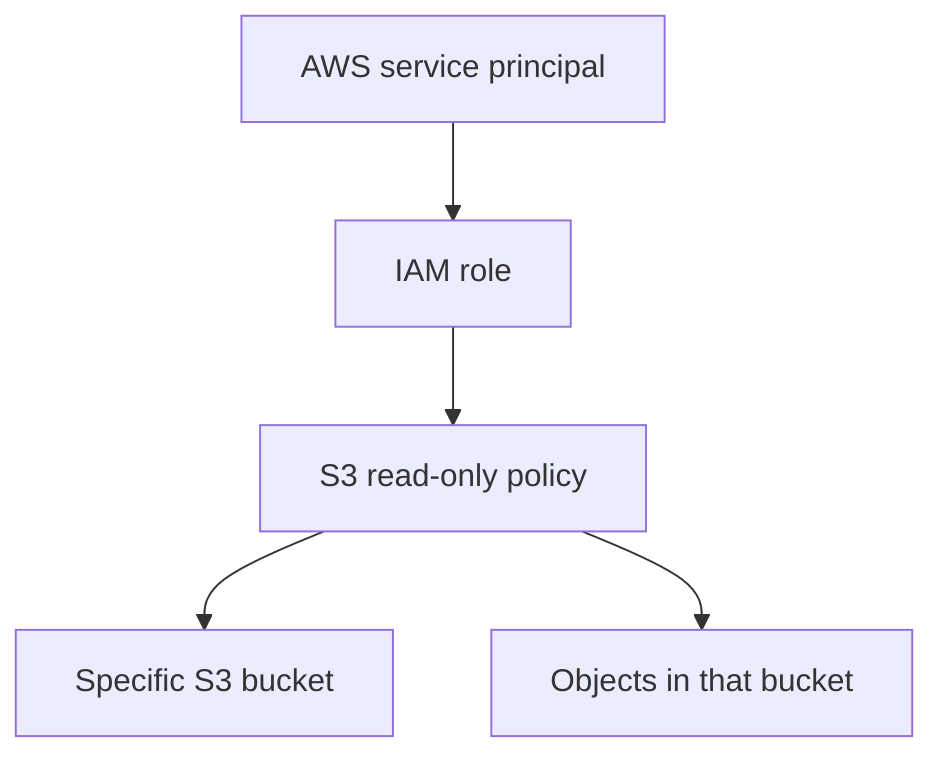

# terraform-aws-iam-baseline


> Small Terraform module that creates a least-privilege IAM role for read-only access to one S3 bucket.

For the hiring-focused project narrative, see [docs/CASE_STUDY.md](docs/CASE_STUDY.md).

This repository is intentionally scoped to one reviewable IAM pattern: create a service-assumable role with the minimum S3 read permissions needed for a specific bucket. It does not claim to be a full AWS account baseline.

---

## Reviewer Quick Start

For a fast technical review:

1. Inspect `main.tf` to verify that S3 access is scoped to one bucket ARN and its objects.
2. Inspect `variables.tf` to see the module inputs and validation.
3. Run `terraform fmt -check`, `terraform validate`, `tflint`, and `tfsec` through the existing CI workflow.
4. Read [docs/CASE_STUDY.md](docs/CASE_STUDY.md) for the design rationale and limitations.

---

## What It Creates



| Control | Implementation |
|---|---|
| Bucket-scoped access | `s3:ListBucket` is limited to `arn:aws:s3:::<bucket>` |
| Object read access | `s3:GetObject` and `s3:GetObjectVersion` are limited to `arn:aws:s3:::<bucket>/*` |
| Explicit trust boundary | Only configured AWS service principals can assume the role |
| Input validation | Bucket name, role name, and trusted principals must be non-empty |
| Reviewable policy | The IAM policy document is generated from Terraform data sources |

---

## What It Does Not Do

This module does not currently implement:

- IAM account password policy
- MFA enforcement for human users
- AWS Organizations SCPs
- CloudTrail setup
- region lockdown
- Access Analyzer integration
- user or group lifecycle management

Those controls are useful account-baseline features, but they are outside this module's current implementation.

---

## Usage

```hcl
module "s3_read_role" {
  source = "./"

  bucket_name = "my-audit-evidence-bucket"
  role_name   = "audit-evidence-reader"

  trusted_service_principals = [
    "ec2.amazonaws.com"
  ]

  tags = {
    Environment = "dev"
    Owner       = "security"
  }
}
```

---

## Requirements

- Terraform >= 1.5
- AWS provider >= 5.0
- IAM permissions to create roles, policies, and policy attachments

---

## Outputs

| Output | Description |
|---|---|
| `policy_arn` | ARN of the generated S3 read-only IAM policy |
| `role_name` | Name of the IAM role with the policy attached |

---

## Next Improvements

To turn this into a true AWS IAM baseline, add:

- account password policy
- MFA enforcement policy for interactive users
- read-only audit role for IAM, CloudTrail, Config, and Security Hub review
- optional region restriction policy/SCP example
- Terraform tests for policy contents
- Access Analyzer validation notes

---

## License

MIT
